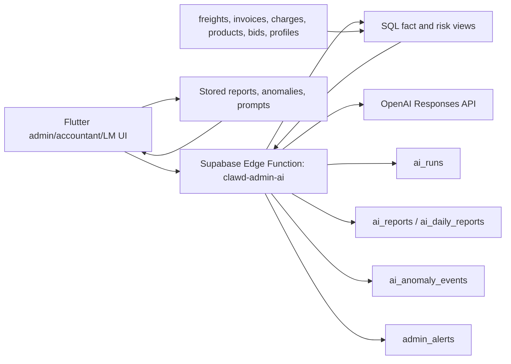
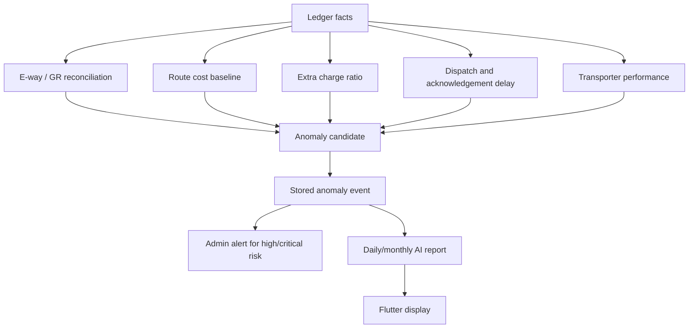

# Clawd AI Backend Architecture

## Goal

Clawd is the explanation and action layer for Kaysons logistics operations. Flutter should only display insights, alerts, reports, prompt templates, and chat answers. Supabase stores the facts, calculates derived metrics, runs anomaly candidates, and stores every AI run/output for audit and cost control.

## Architecture Decision

Clawd does not calculate totals in the model prompt. SQL views calculate freight totals, delay, acknowledgement gaps, e-way/GR mismatch risk, extra charge ratio, route cost baselines, transporter performance, and anomaly candidates. AI receives those computed facts and explains what changed, why it matters, and what action to take.

## Implemented Backend Pieces

- `ai_prompt_templates`: admin-owned reusable prompts, also readable by accountants.
- `ai_runs`: audit record for every chat, saved prompt, daily report, monthly report, and failure.
- `ai_reports`: daily/monthly report history with risk score and recommendations.
- `ai_anomaly_events`: stored anomaly events with open/resolved/false-positive review state.
- `clawd_freight_fact_view`: per-freight derived facts for AI and reports.
- `clawd_route_cost_baseline_view`: route cost baseline and recent cost comparison.
- `clawd_transporter_performance_view`: transporter delivery, delay, and proof performance.
- `clawd_eway_reconciliation_view`: invoice/e-way/GR reconciliation signals.
- `clawd_charge_risk_view`: extra-charge and deduction risk signals.
- `clawd_delay_risk_view`: bill-to-dispatch delay and acknowledgement delay signals.
- `clawd_anomaly_candidates_view`: SQL-generated anomaly queue before AI explanation.

## Edge Function Actions

- `chat`: answers admin/accountant/LM questions using computed facts.
- `detect_anomalies`: persists SQL anomaly candidates into `ai_anomaly_events` and high-risk `admin_alerts`.
- `daily_report`: scans anomalies, asks AI for a daily explanation, and stores report history.
- `monthly_report`: same pattern for month-to-date reporting.
- `template_run`: runs a saved admin prompt against current backend facts.

## Fraud And Cost Signals

Examples Clawd can now support:

- E-way or GR mismatch review before invoice closure.
- Duplicate e-way bill risk.
- Same route and transporter suddenly costing much more than baseline.
- Extra freight, detention, toll, point charge, out-route, or deduction patterns.
- Bill date to dispatch date delay.
- Pending acknowledgement after delivery.
- Transporter-specific delay and missing proof trends.

## Frontend Rule

The app never stores OpenAI keys and does not run AI logic locally. Admin, accountant, and logistics-manager screens call the Edge Function or read stored Supabase rows. This keeps private keys server-side, keeps output auditable, and lets Clawd be scheduled later without changing Flutter.

## Next Backend Upgrade

For fully proactive operation, add a Supabase Cron job that calls `clawd-admin-ai` with `action = detect_anomalies` daily and another job for `daily_report`. The function already supports a cron secret header; the remaining setup is to add `CLAWD_CRON_SECRET` as an Edge Function secret and create the scheduled request.

## Runtime Verification

Verified on the live project:

- Demo admin password login succeeds.
- Deployed Edge Function `clawd-admin-ai` is active with JWT verification.
- `detect_anomalies` scanned 14 SQL-generated signals and stored 14 anomaly events.
- AI chat successfully answered from backend facts, which confirms the OpenAI Edge Function secret is configured.
- `flutter analyze --no-pub` passes.
- `flutter build web --no-pub` passes.

## Remaining Setup

The only planned AI item not fully automated yet is the scheduled cron trigger. This needs a new secret value to exist in both places:

1. Supabase Edge Function secret: `CLAWD_CRON_SECRET`.
2. Supabase Vault secret used by `pg_cron` / `pg_net` when sending the `x-clawd-cron-secret` header.

This session has no Supabase CLI available, so the Edge Function secret could not be set from the terminal. Once the secret is added, schedule two jobs:

- Daily anomaly scan: call `clawd-admin-ai` with `{"action":"detect_anomalies"}`.
- Daily report: call `clawd-admin-ai` with `{"action":"daily_report"}`.
