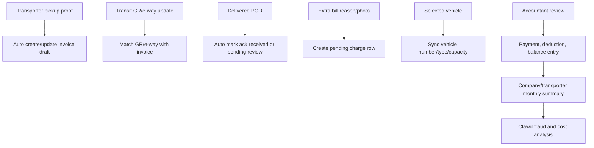

# Freight Ledger Gap Analysis From Demo Excel

## Source Workbooks

- `docs/Demo Data/Karnal TPT -  Apr. 26.xlsx`
- `docs/Demo Data/Ludhiana Sec. Frt. - Apr. 26 (1).xlsx`

## What The Excel Files Contain

### Karnal Transport Format

Karnal is a transporter/product dispatch register. The main fields are:

- Serial number
- Date
- Town
- Bill number
- Vehicle number
- GR number
- Transporter
- Weight
- Quantity
- Product/company buckets: `DELMONTE`, `DR-SMITH`, `FUNFOOD`, `RICH`, `AB`, `PARAG`, `BT`, `HY`, `JC`
- Freight
- Out route
- Point charge
- Toll tax
- Labour
- Total freight
- `DEL` reference

It also has transporter-specific sheets like `PARTH` and `RASHMI`, where the same fields are repeated without the transporter column because the sheet itself is the transporter statement.

### Ludhiana Secondary Freight Format

Ludhiana is a company-wise freight accounting workbook. Raw company sheets like `Bunge Apr.26` and `Cargill Apr. 26` contain:

- Bill date
- Dispatch date
- Delay
- Invoice number
- E-way bill number
- Party name
- Town
- Cases
- Net weight in MT
- Vehicle number
- Vehicle type
- Freight
- Extra freight
- Labour
- Detention
- LR number
- Transport name
- Remarks
- Acknowledgement status

The `Dashboard` sheet adds transporter/company summaries:

- PMT
- Cases
- MT
- Freight
- Extra freight
- Labour
- Detention
- Total freight
- Last month balance
- Payment
- Any deductions
- Balance
- Acknowledgement received/pending
- Town-wise vehicle count, weight, actual freight, extra freight, PMT

## Already Covered In The App/Database

### Database

Covered by `freights`, `invoices`, `freight_charges`, `freight_product_lines`, and reporting views:

- Company name
- Party name
- Bill date
- Dispatch date
- Delay
- Invoice number
- E-way bill number
- LR/GR number
- Town
- Cases
- Weight/MT
- Vehicle number
- Vehicle type
- Transporter
- Freight
- Extra freight
- Labour
- Detention
- Toll tax
- Point charge
- Out-route charge
- Deduction
- Other charges
- Total freight
- PMT
- Acknowledgement status
- Remarks
- Dynamic product quantities
- Company summary
- Transporter summary
- Town summary
- Ack summary
- CSV export

### User Forms

Admin, accountant, and logistics manager ledger screens already support:

- Manual ledger entry
- Multiple invoice lines
- Multiple charge rows
- Multiple product rows
- Transporter selection
- CSV download
- Date/company/transporter/town/ack filters

Transporter and dispatch manager inputs already feed operational tracking:

- Vehicle and driver details
- Dispatch proof
- Pickup/in-transit/delivery proof
- GR/e-way details in tracking JSON
- Dispatch manager vehicle/transit checks

## Missing Or Weak Before This Pass

### 1. Karnal `DEL` Reference

The Karnal sheet has a `DEL` column that was not explicitly stored. This is now added as:

- `invoices.delivery_reference`
- `admin_freight_ledger_view.delivery_reference`
- Admin/accountant/LM ledger form field `DEL ref`
- CSV export column `DEL Ref`

### 2. Ludhiana Settlement Fields

The Ludhiana dashboard tracks monthly settlement controls that were missing:

- Last month balance
- Payment
- Any deductions
- Balance

This is now modeled with:

- `transporter_ledger_settlements`
- `admin_company_transporter_summary_view`
- `admin_freight_ledger_view` appended settlement fields:
  - `period_month`
  - `last_month_balance`
  - `payment_amount`
  - `settlement_deduction`
  - `balance`
  - `settlement_remarks`

### 3. Editability

The ledger was create-first. It now supports editing existing ledger rows from the table. Editing opens the same ledger form prefilled with:

- Freight-level details
- All invoice lines for the freight
- Charge lines
- Product lines
- Settlement fields

Saving updates the freight, replaces invoice/charge/product rows for that freight, and upserts the settlement row for the company/transporter/month.

## Still Not Fully Automated

These are not missing database columns anymore, but they are workflow automation gaps:

- Transporter pickup invoice/e-way/GR proof is not yet automatically converted into invoice rows.
- Transporter delivery proof does not automatically mark acknowledgement as received.
- Extra bill reason/photos from transporter delivery stages do not automatically become pending charge rows.
- Vehicle type/capacity from selected vehicle is not always mirrored to the ledger.
- Payment reconciliation is manual; bank payment import is not implemented.
- Excel import is not implemented yet; current flow is manual entry plus CSV export.

## Recommended Next Implementation

## Role-Specific Improvements

### Admin

- Already has ledger, analytics, Clawd, user management.
- Needs bulk import later for Excel upload.
- Needs settlement review dashboard by company/transporter/month.

### Accountant

- Already has ledger, analytics, Clawd without admin user powers.
- Now can edit ledger rows and settlement values.
- Needs a dedicated payment reconciliation queue later.

### Logistics Manager

- Already can enter ledger details and edit visible ledger entries.
- Should continue filling operational details but should not be responsible for final payment reconciliation long term.

### Transporter

- Already submits dispatch/pickup/transit/delivery evidence.
- Missing automation: their submitted invoice/e-way/GR/POD details should create ledger drafts automatically.

### Dispatch Manager

- Already handles vehicle arrival, mismatch, and transit updates.
- Missing automation: their checks should contribute structured status signals for Clawd and ledger audit history.
