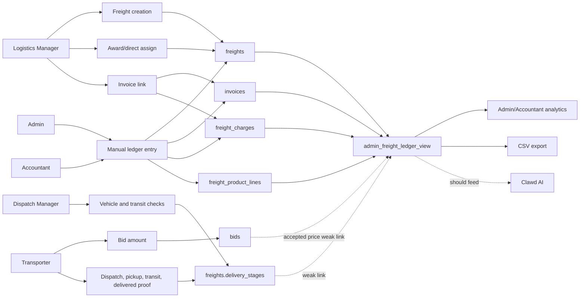
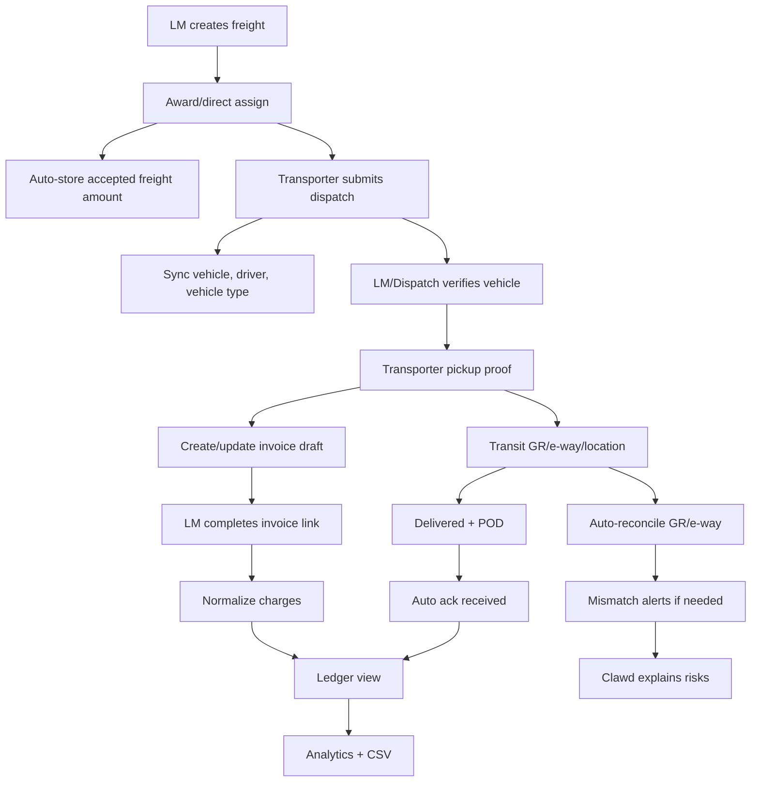

# Freight Ledger Automation Audit

## Purpose

The freight ledger should become the automatic accounting and analysis record for the business. Manual ledger entry should remain available for corrections and exceptional cases, but normal operations should fill the ledger through user actions: freight creation, bidding, awarding, invoice linking, dispatch tracking, delivery proof, and acknowledgement.

The current ledger is built mainly from:

- `freights`
- `invoices`
- `freight_charges`
- `freight_product_lines`
- transporter fields from `profiles`
- reporting view `admin_freight_ledger_view`

Analytics already reads `admin_freight_ledger_view`. Clawd currently reads base tables and should also read ledger/reporting views so AI can explain already-calculated freight facts instead of calculating raw numbers.

## Current Flow

## Role Input Audit

### Admin

Current inputs:

- User management: role, manager assignment, permissions, approval, rejection, deletion.
- Manual ledger entry: company, party, origin, branch, vehicle, vehicle type, transporter, acknowledgement status, invoices, charges, products, remarks.
- Clawd: chat questions and daily analysis trigger.

Stored in:

- `profiles`
- `freights`
- `invoices`
- `freight_charges`
- `freight_product_lines`
- `ai_daily_reports`

Gaps:

- Manual ledger is create-first; editing existing ledger rows is limited.
- Admin Bids navigation currently points to LM routes and is not a clean admin bid detail workflow.
- Clawd does not yet read ledger views or stored prompt templates.

### Accountant

Current inputs:

- Same ledger entry, analytics, and Clawd surfaces as Admin.
- No admin user-management power.

Stored in:

- `freights`
- `invoices`
- `freight_charges`
- `freight_product_lines`
- AI report tables where policies allow it.

Gaps:

- Accountant needs an existing-row edit/correction workflow.
- Accountant needs review queues for unapproved charges, missing ack, e-way mismatch, and delayed freight rather than only manual entry.

### Logistics Manager

Current inputs:

- Freight creation/edit: origin, destination, stops, cases, weight, base freight field, internal calling bid, bid/direct assignment mode, bid window, preferred/blocked transporters.
- Award winner/direct assignment.
- Invoice link: invoice number, GR/Bilty, e-way bill, toll, club, dalla, other.
- Tracking: vehicle confirmation, wrong-details issue, transit location update.
- Manual ledger tab.
- Dispatch manager assignment.

Stored in:

- `freights`
- `freight_preferred_transporters`
- `freight_blocked_transporters`
- `bids`
- `invoices`
- `freight_charges`
- `admin_alerts`
- `profiles`

Gaps:

- The accepted winning bid is not automatically stored as the ledger freight amount.
- Direct assignment has no required price unless entered later.
- Invoice link is too thin for ledger: missing company, party, bill date, dispatch date, town, cases, weight, vehicle type, product rows, and acknowledgement.
- Charge kinds use `toll`, `club`, `dalla`, and `other`, while the ledger expects standardized kinds like `toll_tax`, `point_charge`, `out_route`, and `other`.

### Dispatch Manager

Current inputs:

- Vehicle arrival confirmation.
- Wrong vehicle/driver issue.
- Current transit location update.
- Profile details.

Stored in:

- `freights.delivery_stages`
- `admin_alerts`
- `profiles`

Gaps:

- Dispatch confirmations are useful but mostly remain operational facts.
- Transit location is not surfaced in ledger analysis.
- Delivery completion does not automatically update acknowledgement or invoice reconciliation.

### Transporter

Current inputs:

- Profile, business, GST/contact, RC, insurance, bank details.
- Vehicles: number, type, capacity, RC, insurance.
- Drivers: name, phone, licence.
- Bid amount.
- Dispatch: vehicle, driver, lorry photo, driver photo, Aadhaar photo.
- Pickup: invoice number, invoice photo, driver phone, site photo.
- In transit: subcontractor details, GR/Bilty, e-way bill, current location, site photo.
- Delivered: receiver, receiver phone, GR, e-way bill, POD photo, bill reason/photo, site photo.

Stored in:

- `profiles`
- `bank_accounts`
- `vehicles`
- `drivers`
- `bids`
- `freights.delivery_stages`
- Supabase Storage paths inside delivery-stage JSON

Gaps:

- Pickup and delivery invoice data is trapped in `delivery_stages` JSON.
- No automatic invoice draft is created from pickup invoice number/photo.
- No automatic acknowledgement update from POD.
- Extra bill reason/photo is not a structured pending charge.
- Vehicle selection stores `vehicle_id` in JSON but does not mirror vehicle type/capacity to ledger fields.

## Missing Automation

1. Accepted bid amount should become ledger freight automatically.
2. Direct assignment should require and store agreed freight amount.
3. LM invoice link should become a full ledger invoice capture screen.
4. Transporter pickup invoice number/photo should create or update invoice draft data.
5. GR and e-way bill from transit/delivery should reconcile against invoice rows.
6. POD submission should mark acknowledgement received by default.
7. Extra bill reason/photo should create a pending charge review item.
8. Vehicle type/capacity should sync from selected vehicle into freight/ledger fields.
9. Charge kinds should be normalized before ledger totals are calculated.
10. Clawd should read ledger and summary views, not only raw tables.

## Recommended Automatic Ledger Flow

## Improvements

- Add a shared ledger-sync layer through SQL functions/RPCs or a repository method, so every operational action updates ledger fields consistently.
- Expand LM invoice link into the primary structured accounting checkpoint.
- Keep manual ledger entry for admin/accountant, but treat it as fallback/correction.
- Add edit flows for invoices, charges, product lines, acknowledgement, and remarks.
- Add anomaly queues for missing POD, invoice/e-way mismatch, pending charges, high PMT, delayed dispatch, and stale transit location.
- Feed Clawd from `admin_freight_ledger_view`, summary views, and anomaly candidates.

## Defaults Chosen

- Acknowledgement becomes `received` when transporter submits POD at delivered stage.
- Company, party, bill date, and invoice details should be captured mainly in LM invoice link.
- Manual ledger remains available for corrections and legacy/offline data.
